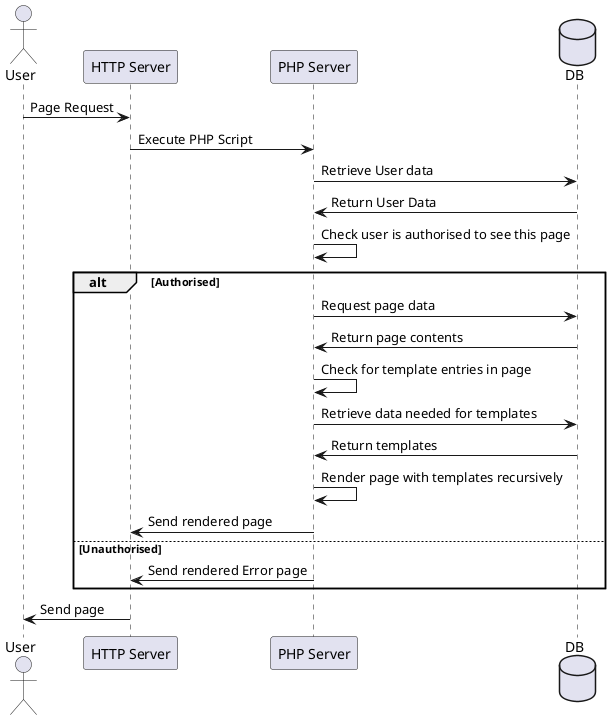

# Why Wiki.JS?
You might be wondering why this wiki is running Wiki.js and not MediaWiki, and the reason for that is slightly more complex than purely for cosmetic and preference reasons.

While I will admit that there is a certain bias in the choice of Wiki.js, I do not believe that it changes much outside of which replacement we are using (as I would have likely recommended a change to a different platform if Wiki.js didn't exist anyway).

## The technical perspective
Since I cannot make an assumption on the knowledge of the reader around the internals of each wiki platform, I will spend some time introducing how each of these two platforms operates on a technical level.

### MediaWiki
MediaWiki is a knowledgebase platform built on PHP and backed by a combination of a filestore and SQL-compliant database (such as postgresql and mariadb).

Its page retrieval operates (roughly) as follows:

As you can see here, there is 3 services (at minimum) involved in making a page available to a user.